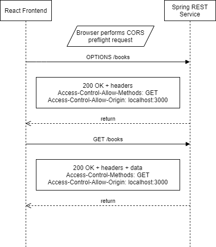

*If you would like to support these tutorials, you can contribute to my [Patreon account](https://patreon.com/czetsuya)

# Spring CORS

Configure CORS in a Spring Boot REST application to make it accessible from a frontend application such as React or 
Angular.

This is the resource server of this exercise.

Client side is available at https://github.com/czetsuya/spring-cors-nextjs.

## What is CORS and why do we need CORS? 
   
CORS or Cross-Origin Resource Sharing is a browser security feature that restricts accessing the resource of server b 
from an HTTP request initiated by a script coming from server a.

Normally, we have our API server running on the backend such as api.czetsuyatech.com. This is where actual data 
fetch and manipulation happens. 

On the other side, we have our frontend client which is normally powered by either React, Angular, or Vue. 
For example, czetsuya.com.

### How CORS Work?



This is a sequence diagram when calling GET /books endpoint.

1. Perform a CORS preflight request
2. If CORS headers from the server match the client proceed, otherwise throw a CORS error
3. Return response with data.a
   
## Different Ways of Configuring CORS

### CrossOrigin 

CrossOrigin is a Spring annotation that we can use on any Java type or method to configure CORS.
This is good if you just have one or two endpoints.

I normally use it to override the global configuration when testing a particular endpoint.

### Globally via Spring WebMvcConfigurer

In practice, we would normally use this approach as often we have a defined set of clients who will access the 
resource server in the same way. And having the configuration in the same place makes maintenance easier.

Here's an example configuration:

```java
@Configuration
public class WebMvcConfig implements WebMvcConfigurer {

  @Override
  public void addCorsMappings(CorsRegistry registry) {
    registry.addMapping("/**")
        .allowedMethods("*")
        .allowedHeaders("*")
        .allowedOrigins("http://192.168.1.9:8080", "http://192.168.1.9:3000")
        .allowCredentials(false)
        .maxAge(-1);
  }
}
```

- "*" means it will accept any allowable value for that field. For example, allowedMethods will accept GET, POST, 
  PUT, DELETE, OPTION, etc. @see org.springframework.http.HttpMethod.
- allowedOrigins, tells Spring to only accept Ajax requests from these URL patterns.
- maxAge - indicates how long to cache the result of a CORS preflight request.

## Deployment and Testing

To see how CORS work clone the following GIT repositories:

- https://github.com/czetsuya/spring-cors - Spring Boot project
- https://github.com/czetsuya/spring-cors-nextjs - React/NextJS project

### Requirements

You must have the following components installed on your local machine:

- OpenJDK 11 - https://developers.redhat.com/products/openjdk/download
- Node - https://nodejs.org/en/download
- Yarn - in terminal execute, npm install --global yarn

In the root of the spring-cors project execute: mvn spring-boot:run

In the root of spring-cors-nextjs project execute: yarn install && yarn dev

Fire up your browser, and open http://<yourNetworkIp>:3000.

## References

- https://www.czetsuyatech.com/2021/05/how-to-configure-cors-in-spring-boot.html
- https://spring.io/guides/gs/rest-service-cors
- https://developer.mozilla.org/en-US/docs/Glossary/preflight_request